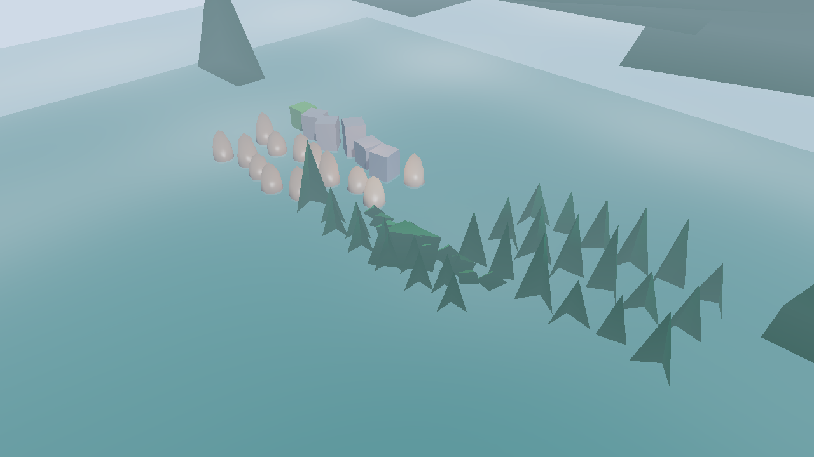
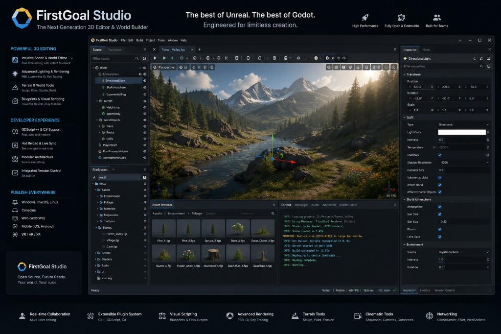

<p align="center">
  
</p>

<p align="center">
  <strong>Build worlds. Ship games. Stay in control.</strong><br/>
  <sub>A modern 3D game engine in Rust — fast, safe, and built for real production.</sub>
</p>

<p align="center">
  
  
  
  
</p>

<p align="center">
  <a href="#status--pre-alpha">Status</a> ·
  <a href="#studio-preview">Studio preview</a> ·
  <a href="#why-shiloh3d">Why Shiloh3D</a> ·
  <a href="#get-started">Get started</a> ·
  <a href="#roadmap">Roadmap</a> ·
  <a href="#learn-more">Learn more</a>
</p>

---

## Status — Pre-Alpha

**Shiloh3D is pre-alpha and a work in progress.** APIs, editor UX, and visuals change often. Expect incomplete features, rough edges, and a visual gate that still fails against the FirstGoal photoreal target. Useful for early prototyping and contributing — **not** a production ship bar yet.

| | |
|---|---|
| **Version** | `0.1.0` · pre-alpha |
| **Studio** | Docked editor runs; live viewport + Landscape / Foliage Modes |
| **Demo game** | [Lions Gate](lions-gate/README.md) ARPG slice (Town · Forest · Swamp) |
| **Honest bar** | Outdoor still is **not** photoreal yet — greybox → textured world is active work |

---

## Studio preview

Current **Shiloh Studio** captures (working editor — visuals still improving):

<p align="center">
  <br/>
  <sub>Shiloh Studio — Forest Valley in the live viewport (pre-alpha)</sub>
</p>

<p align="center">
  <br/>
  <sub>Editor E2E capture used by the Compete visual gate</sub>
</p>

<p align="center">
  <br/>
  <sub>Design target — FirstGoal Studio mockup (quality we are building toward)</sub>
</p>

More captures: [`docs/screenshots/`](docs/screenshots/) · gate report: [`docs/screenshots/gate-report.md`](docs/screenshots/gate-report.md)

---

## Why Shiloh3D?

Shiloh3D is a **from-scratch 3D game engine** for teams that want:

- A **polished editor** and clear workflow  
- **High-end look** where it matters (lighting, materials, atmosphere, water)  
- **Large worlds** and multiplayer as first-class goals — not afterthoughts  
- An open stack you can own, extend, and ship with confidence  

We compete on **usability** and **selected graphical quality** — not on matching every feature of a commercial mega-engine on day one.

**Christian-owned** and designed to be **bundled into other games** (the same role Unreal / Godot play for many titles).

> *“And the whole congregation of the children of Israel assembled together at Shiloh, and set up the tabernacle of the congregation there. And the land was subdued before them.”*  
> — Joshua 18:1 (KJV)

---

## What you get

| | |
|---|---|
| **Runtime** | Solid frame loop, entities, scenes, input, timing |
| **Look** | Lit 3D path with shadows, fog, water, HUD, and color grading |
| **Content** | glTF import, save/load scenes, isometric camera for ARPG / RTS feel |
| **Tools** | Scene editor (hierarchy, inspector, play mode, script IDE) · project CLI |
| **Platforms** | Desktop bring-up today · path to native GPU and web |

**Quality target:** cinematic ARPG swamp presentation — mood, atmosphere, and **real water**. See the [quality bar](docs/QUALITY_BAR.md).

---

## Get started

**Need:** Rust 1.85+ and a C linker (`gcc` or `clang`).

```bash
# Open the scene editor (design UI)
cargo run -p shiloh-editor

# Play the engine showcase
cargo run -p shiloh-demo

# Lions Gate ARPG slice (menu · Town/Forest/Swamp)
cargo run -p lions-gate

# Quick headless check
cargo run -p shiloh-demo -- --headless-frames 60
```

| Control (demo) | Action |
|---|---|
| WASD | Pan |
| Drag | Pan |
| Scroll | Zoom |
| Esc | Quit |

---

## How the product is organized

Everything is a focused library. Games talk to **Shiloh APIs** — not raw third-party engine guts.

| Piece | What it does for you |
|---|---|
| **App** | Window, lifecycle, run loop, OS taskbar icon |
| **Editor** | Docked Studio shell — outliner, inspector, node graph, script IDE, world items, play / stop |
| **Scene** | Worlds of objects, parents/children, cameras, terrain / foliage |
| **Assets** | Load meshes and materials (glTF) |
| **Render** | Draw the frame — lights, shadows, water, UI overlay |
| **Animation · Physics · Audio** | Motion, bodies, sound (growing every phase) |
| **Scripting** | Rhai + visual graph; Rust modules for ship code |
| **Network** | Multiplayer foundations early |
| **CLI** | New project, cook, one-click desktop pack |
| **Lions Gate** | Sample Christian ARPG vertical slice |

Full module list and policies live in the docs below — this page stays product-focused.

---

## Roadmap

| Phase | Focus | Status |
|---|---|---|
| **1** | Core engine & world-builder foundation | **Done** |
| **2** | Usable 3D vertical slice | **Done** |
| **3** | Production exit (terrain/nav deferred) | **Exit done** |
| **4** | Competitive foundations (GI / GPU-driven open) | **In progress** |
| **5** | World editor & authoring scripting | **Shell done** — judged by Compete E2E |
| **Compete** | Godot-easy · Unreal-capable · **FirstGoal E2E gate** | **Active (FAIL until match)** |

**Right now:** E2E success = Forest Valley still **matches** the uploaded FirstGoal Studio editor viewport (not greybox heuristics alone):

```bash
cargo run -p shiloh-editor --example visual_gate
```

Report: [`docs/screenshots/gate-report.md`](docs/screenshots/gate-report.md) · Spec: [Phase Compete](docs/PHASE_COMPETE.md) · Reference: [`docs/references/firstgoal-studio-editor.png`](docs/references/firstgoal-studio-editor.png)

Details: [Roadmap](docs/ROADMAP.md) · [Quality bar](docs/QUALITY_BAR.md) · [Editor UX](docs/EDITOR_UX.md) · [Packaging](docs/PACKAGING.md)

---

## Open-source attributions

Shiloh wraps and builds on FOSS. We do **not** vendor Unreal/Godot source; we **borrow UX patterns** (documented in [EDITOR_UX.md](docs/EDITOR_UX.md)) and depend on Rust crates under their licenses:

| Project | Use in Shiloh | License (typical) |
|---|---|---|
| [wgpu](https://github.com/gfx-rs/wgpu) | GPU bootstrap / RHI path | MIT / Apache-2.0 |
| [winit](https://github.com/rust-windowing/winit) | Window / input host | Apache-2.0 |
| [egui](https://github.com/emilk/egui) / [eframe](https://github.com/emilk/egui) | Studio UI shell | MIT / Apache-2.0 |
| [glam](https://github.com/bitshifter/glam-rs) | Math | MIT / Apache-2.0 |
| [glTF](https://github.com/gltf-rs/gltf) | Asset import | MIT / Apache-2.0 |
| [Rhai](https://github.com/rhaiscript/rhai) | Designer scripting (Phase 5) | MIT / Apache-2.0 |
| [Parry](https://github.com/dimforge/parry) | Mesh BVH raycast (accurate edit / RayAccurate mode) | Apache-2.0 |
| [Poly Haven](https://polyhaven.com/) CC0 props | Editor foliage/rock samples | CC0 |

Full stack policy: [TECH_STACK.md](docs/TECH_STACK.md). When we copy *algorithms* or snippets beyond crates.io deps, cite them next to the code and in this table.

---

## Learn more

| Doc | For |
|---|---|
| [Phase Compete](docs/PHASE_COMPETE.md) | Visual gate · Godot-easy / Unreal-capable bar |
| [Editor UX](docs/EDITOR_UX.md) | Borrow map (Godot / Unreal) |
| [Quality bar](docs/QUALITY_BAR.md) | Blackmarsh presentation target |
| [Roadmap](docs/ROADMAP.md) | What’s done and what’s next |
| [Tech stack](docs/TECH_STACK.md) | How we choose and wrap tools |
| [Graphics](docs/GRAPHICS.md) | Desktop, web, and GPU paths |
| [Premium brief](docs/PREMIUM.md) | Product overview & gallery |
| [Packaging](docs/PACKAGING.md) | One-click Windows · macOS · Ubuntu pack |
| [Blender pipeline](docs/BLENDER_PIPELINE.md) | glTF peer cook path |
| [Showcase demo](shiloh-demo/README.md) | Running the sample |
| [Lions Gate](lions-gate/README.md) | Christian ARPG demo slice |

---

## License

MIT **or** Apache-2.0 — your choice.

---

<p align="center">
  <br/>
  <sub>Pre-alpha · work in progress · Christian-owned · bundleable</sub>
</p>
