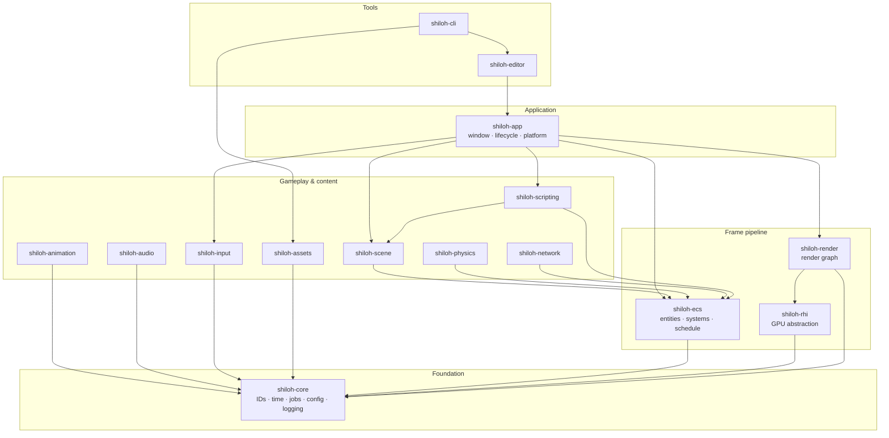
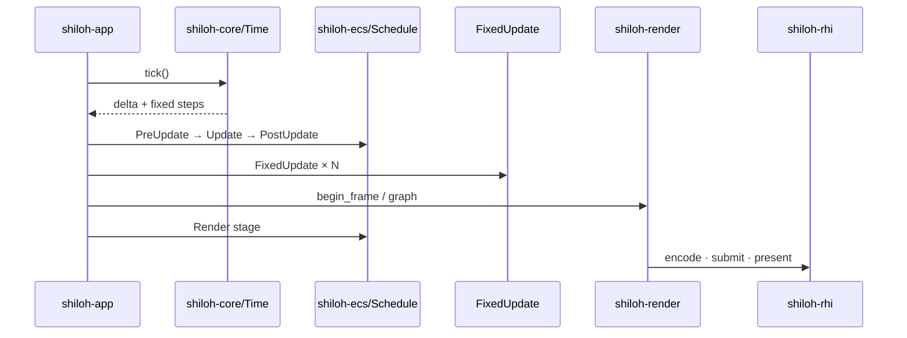

<p align="center">
  
</p>

<h1 align="center">Shiloh3D</h1>

<p align="center">
  <strong>A modern 3D game engine written in Rust — from scratch.</strong><br/>
  Performance-first · custom façades · wgpu+WGSL bootstrap · native/web backends
</p>

<blockquote align="center">
  <p>
    <em>“And the whole congregation of the children of Israel assembled together at Shiloh,<br/>
    and set up the tabernacle of the congregation there.<br/>
    And the land was subdued before them.”</em><br/>
    <sub>— Joshua 18:1 (KJV)</sub>
  </p>
</blockquote>

<p align="center">
  <a href="#architecture">Architecture</a> ·
  <a href="#modules">Modules</a> ·
  <a href="#quick-start">Quick start</a> ·
  <a href="#features">Features</a> ·
  <a href="docs/ROADMAP.md">Roadmap</a> ·
  <a href="docs/TECH_STACK.md">Tech stack</a> ·
  <a href="docs/GRAPHICS.md">Graphics</a> ·
  <a href="docs/PREMIUM.md">Premium tech brief</a>
</p>

---

## What is Shiloh3D?

**Shiloh3D** is a greenfield 3D game engine built as a Cargo workspace of focused crates. Prefer **custom Shiloh code**; adopt crates like wgpu, winit, Rapier, and egui only behind **stable engine façades** ([docs/TECH_STACK.md](docs/TECH_STACK.md)).

Graphics **bootstrap** is wgpu + WGSL; **shipping desktop** targets native Vulkan/D3D12/Metal on the same RHI; **web** uses WebGL / WebGPU ([docs/GRAPHICS.md](docs/GRAPHICS.md)). Headless CI uses a null device.

**Direction:** a fast, safe, open Rust engine with a polished visual editor, excellent PBR, large-world support, and first-class multiplayer — proven first as a **vertical slice**, then expanded. See [docs/ROADMAP.md](docs/ROADMAP.md).

| | |
|---|---|
| **Language** | Rust (edition 2024) |
| **License** | MIT OR Apache-2.0 |
| **Status** | Early foundation (`0.1.0`) — runtime shell + crate architecture |
| **Math** | [`glam`](https://docs.rs/glam) |
| **GPU path** | wgpu+WGSL bootstrap behind RHI · native shipping · WebGL/WebGPU — [GRAPHICS](docs/GRAPHICS.md) · [TECH_STACK](docs/TECH_STACK.md) |
| **Scripting** | Native Rust modules first; embeddable JS / Rhai planned |

---

## Architecture

### Layered view



### Runtime frame loop



### Design principles

- **Crate boundaries** — each subsystem is a library with a clear public API  
- **Generational handles** — stable IDs that detect stale references  
- **Archetype ECS** — cache-friendly SoA storage for systems  
- **Job system** — work-stealing workers for parallel frame work  
- **Render graph** — declare passes/resources; compile to execution order  
- **Native-first graphics** — RHI with Vulkan/D3D12/Metal primary; wgpu + WebGL as extensions (see [GRAPHICS.md](docs/GRAPHICS.md))  
- **Rust as far as possible** — null device by default for CI; windowing / GPU features opt-in  
- **Scripting-ready** — `ScriptModule` today; custom JS/Rhai backends planned  

---

## Modules

| Crate | Role |
|---|---|
| [`shiloh-app`](shiloh-app/) | Window, lifecycle, platform integration; headless by default |
| [`shiloh-core`](shiloh-core/) | Generational IDs, time, logging, jobs, frame scratch, config |
| [`shiloh-ecs`](shiloh-ecs/) | Entities, components, archetype storage, systems, stages |
| [`shiloh-render`](shiloh-render/) | High-level renderer + transient render graph |
| [`shiloh-rhi`](shiloh-rhi/) | RHI — native primary, wgpu extension, WebGL, null |
| [`shiloh-scene`](shiloh-scene/) | Scenes, parent/child hierarchy, transforms, prefabs |
| [`shiloh-assets`](shiloh-assets/) | Import, cache, packages; optional hot-reload |
| [`shiloh-physics`](shiloh-physics/) | Physics backend trait + stub integrator |
| [`shiloh-animation`](shiloh-animation/) | Skeletons, clips, blending, state machines |
| [`shiloh-audio`](shiloh-audio/) | Spatial sources, listener, software mixer |
| [`shiloh-input`](shiloh-input/) | Keyboard, mouse, gamepad, touch — double-buffered |
| [`shiloh-network`](shiloh-network/) | Replication IDs + transport (in-memory loopback) |
| [`shiloh-scripting`](shiloh-scripting/) | Rust game modules; embeddable custom scripts later |
| [`shiloh-editor`](shiloh-editor/) | Project management & selection model (UI later) |
| [`shiloh-cli`](shiloh-cli/) | Create projects, package assets, automation |

```
Shiloh3D
├── shiloh-app          Window, lifecycle and platform integration
├── shiloh-core         IDs, time, logging, jobs and configuration
├── shiloh-ecs          Entities, components, systems and scheduling
├── shiloh-render       Render graph and high-level renderer
├── shiloh-rhi          Native GPU RHI (+ wgpu extension, WebGL)
├── shiloh-scene        Scenes, hierarchy, transforms and prefabs
├── shiloh-assets       Importing, caching, hot reload and packages
├── shiloh-physics      Physics abstraction
├── shiloh-animation    Skeletons, blending and state machines
├── shiloh-audio        Spatial audio and mixing
├── shiloh-input        Keyboard, mouse, controller and touch
├── shiloh-network      Replication and multiplayer transport
├── shiloh-scripting    Rust modules and later visual / JS scripting
├── shiloh-editor       Scene editor and project management
└── shiloh-cli          Build, package, import and automation tools
```

---

## Features

| Area | Today | Next |
|---|---|---|
| **Core runtime** | Time, jobs, config, handles | Profiling hooks |
| **ECS** | Spawn, components, staged schedule | Full archetype moves, parallel systems |
| **Rendering** | Graph + null + wgpu demo path | Native backends, textures, PBR |
| **Scene** | Transform + hierarchy types | Dirty propagation, prefab instantiate |
| **Physics** | Stub backend | Rapier (Rust) integration |
| **Audio** | Mixer stub | cpal / rodio output |
| **Scripting** | `ScriptModule` (Rust) | JavaScript (Boa) and/or Rhai |
| **Editor** | Project files on disk | Scene viewport & inspectors |
| **Networking** | In-memory transport | QUIC / reliable channels |

Optional Cargo features:

```bash
# Null RHI (CI)
cargo check -p shiloh-rhi

# wgpu extension (current demo path)
cargo check -p shiloh-rhi --features wgpu

# Native primary stubs / WebGL stubs
cargo check -p shiloh-rhi --features native
cargo check -p shiloh-rhi --features web
```

---

## Quick start

**Requirements:** Rust stable ≥ 1.85 (`rustup`), and a system linker (`gcc` / `clang`).

```bash
# Check the whole workspace
cargo check --workspace

# Showcase demo (windowed GPU — Windows / macOS / Linux)
cargo run -p shiloh-demo --release

# Headless smoke
cargo run -p shiloh-demo -- --headless-frames 60

# Run the headless runtime shell (few frames, then exit)
cargo run -p shiloh-app

# CLI
cargo run -p shiloh-cli -- info
cargo run -p shiloh-cli -- new my_game --path .
```

Logging uses `tracing`. Example:

```bash
RUST_LOG=debug cargo run -p shiloh-app
```

---

## Tech stack (at a glance)

Prefer custom Shiloh code; wrap third parties — full policy in [TECH_STACK.md](docs/TECH_STACK.md).

| Concern | Choice |
|---|---|
| Workspace | Cargo resolver 2, shared lints & release LTO |
| Math | `glam` (public exception for now) |
| Concurrency | Custom `JobSystem` (+ Rayon inside impls) |
| Config / assets | serde + versioned engine formats; **glTF** first |
| Diagnostics | `tracing`; Tracy + GPU timestamps planned |
| CLI | `clap` |
| GPU bootstrap | **wgpu** + **WGSL** behind `shiloh-rhi` / `shiloh-render` |
| GPU shipping | Native Vulkan/D3D12/Metal on same RHI |
| Web GPU | WebGL + WebGPU (wgpu) |
| Window / input | **winit** behind `shiloh-app` / `shiloh-input` |
| ECS | **Custom** `shiloh-ecs` |
| Editor GUI | **egui** behind `shiloh-editor` (planned) |
| Physics | **Rapier** behind `shiloh-physics` (planned) |
| Audio | **Kira**/native behind `shiloh-audio` (planned) |
| Scripting | Rust modules first |

Release profile uses thin LTO and a single codegen unit for ship builds.

---

## Documentation

| Doc | Description |
|---|---|
| **[Quality bar](docs/QUALITY_BAR.md)** | What it takes to ship ARPG-class worlds (reference analysis) |
| **[Tech stack](docs/TECH_STACK.md)** | Advised crates, custom-first policy, API boundary rules |
| **[Graphics backends](docs/GRAPHICS.md)** | wgpu bootstrap · native shipping · WebGL |
| **[Roadmap](docs/ROADMAP.md)** | Phases 1–4 development sequence with live status |
| **[Premium tech brief](docs/PREMIUM.md)** | Product-facing overview + screenshot gallery |
| **[Performance review](docs/PERF_REVIEW.md)** | Hot-path review of demo + engine foundations |
| **[Showcase demo](shiloh-demo/README.md)** | Cross-platform GPU demo (Win / macOS / Linux) |
| This README | Architecture, modules, build & run |

Screenshots will live under [`docs/screenshots/`](docs/screenshots/) once the editor and renderer produce capturable frames.

---

## Roadmap

See **[docs/ROADMAP.md](docs/ROADMAP.md)** for the full four-phase plan.

| Phase | Theme | Where we are |
|---|---|---|
| **1** | Core runtime | **In progress** — window/GPU/demo loop exist; textures, hierarchy systems, full ECS still open |
| **2** | Usable 3D (vertical slice) | Next — editor + PBR path toward the product thesis |
| **3** | Production workflow | Later — hot reload, packaging, profiling |
| **4** | Competitive scale | Last — GPU-driven, GI, consoles, marketplace, … |

**Near-term:** finish Phase 1, then one Phase 2 vertical slice (editor · PBR · world hooks · multiplayer foundations) before broadening scope.

---

## License

Licensed under either of

- Apache License, Version 2.0, or  
- MIT license  

at your option.

---

<p align="center">
  <br/>
  <sub>Shiloh3D — built in Rust, designed for real-time 3D.</sub>
</p>
