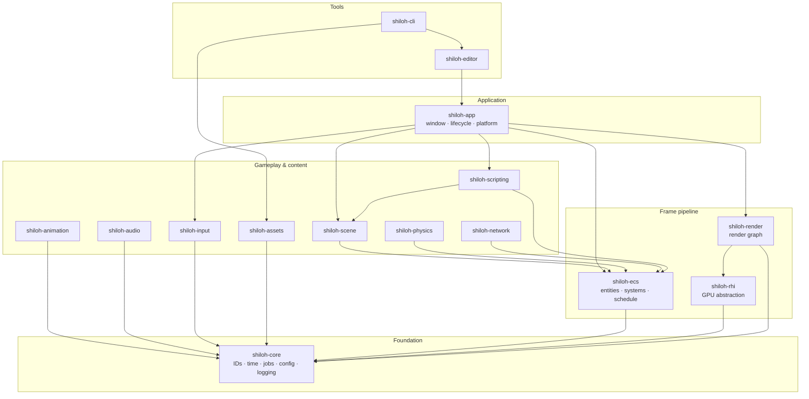
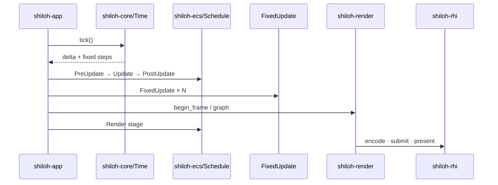

<p align="center">
  
</p>

<h1 align="center">Shiloh3D</h1>

<p align="center">
  <strong>A modern 3D game engine written in Rust — from scratch.</strong><br/>
  Performance-first · modular crates · pure-Rust defaults · optional GPU backends
</p>

<p align="center">
  <a href="#architecture">Architecture</a> ·
  <a href="#modules">Modules</a> ·
  <a href="#quick-start">Quick start</a> ·
  <a href="#features">Features</a> ·
  <a href="docs/PREMIUM.md">Premium tech brief</a>
</p>

---

## What is Shiloh3D?

**Shiloh3D** is a greenfield 3D game engine built as a Cargo workspace of focused crates. The stack favors industry patterns used in high-performance engines — generational IDs, archetype ECS, work-stealing jobs, render graphs — while keeping the **default build pure Rust** (no native GPU/window deps until you opt in).

| | |
|---|---|
| **Language** | Rust (edition 2024) |
| **License** | MIT OR Apache-2.0 |
| **Status** | Early foundation (`0.1.0`) — runtime shell + crate architecture |
| **Math** | [`glam`](https://docs.rs/glam) |
| **GPU path** | Abstract RHI → optional [`wgpu`](https://wgpu.rs) |
| **Scripting** | Native Rust modules first; embeddable JS / Rhai planned |

---

## Architecture

### Layered view



### Runtime frame loop



### Design principles

- **Crate boundaries** — each subsystem is a library with a clear public API  
- **Generational handles** — stable IDs that detect stale references  
- **Archetype ECS** — cache-friendly SoA storage for systems  
- **Job system** — work-stealing workers for parallel frame work  
- **Render graph** — declare passes/resources; compile to execution order  
- **Rust as far as possible** — null/software backends by default; `wgpu` / windowing behind features  
- **Scripting-ready** — `ScriptModule` today; custom JS/Rhai backends planned  

---

## Modules

| Crate | Role |
|---|---|
| [`shiloh-app`](shiloh-app/) | Window, lifecycle, platform integration; headless by default |
| [`shiloh-core`](shiloh-core/) | Generational IDs, time, logging, jobs, frame scratch, config |
| [`shiloh-ecs`](shiloh-ecs/) | Entities, components, archetype storage, systems, stages |
| [`shiloh-render`](shiloh-render/) | High-level renderer + transient render graph |
| [`shiloh-rhi`](shiloh-rhi/) | Render hardware interface — `NullDevice` / optional wgpu |
| [`shiloh-scene`](shiloh-scene/) | Scenes, parent/child hierarchy, transforms, prefabs |
| [`shiloh-assets`](shiloh-assets/) | Import, cache, packages; optional hot-reload |
| [`shiloh-physics`](shiloh-physics/) | Physics backend trait + stub integrator |
| [`shiloh-animation`](shiloh-animation/) | Skeletons, clips, blending, state machines |
| [`shiloh-audio`](shiloh-audio/) | Spatial sources, listener, software mixer |
| [`shiloh-input`](shiloh-input/) | Keyboard, mouse, gamepad, touch — double-buffered |
| [`shiloh-network`](shiloh-network/) | Replication IDs + transport (in-memory loopback) |
| [`shiloh-scripting`](shiloh-scripting/) | Rust game modules; embeddable custom scripts later |
| [`shiloh-editor`](shiloh-editor/) | Project management & selection model (UI later) |
| [`shiloh-cli`](shiloh-cli/) | Create projects, package assets, automation |

```
Shiloh3D
├── shiloh-app          Window, lifecycle and platform integration
├── shiloh-core         IDs, time, logging, jobs and configuration
├── shiloh-ecs          Entities, components, systems and scheduling
├── shiloh-render       Render graph and high-level renderer
├── shiloh-rhi          wgpu abstraction and GPU resources
├── shiloh-scene        Scenes, hierarchy, transforms and prefabs
├── shiloh-assets       Importing, caching, hot reload and packages
├── shiloh-physics      Physics abstraction
├── shiloh-animation    Skeletons, blending and state machines
├── shiloh-audio        Spatial audio and mixing
├── shiloh-input        Keyboard, mouse, controller and touch
├── shiloh-network      Replication and multiplayer transport
├── shiloh-scripting    Rust modules and later visual / JS scripting
├── shiloh-editor       Scene editor and project management
└── shiloh-cli          Build, package, import and automation tools
```

---

## Features

| Area | Today | Next |
|---|---|---|
| **Core runtime** | Time, jobs, config, handles | Profiling hooks |
| **ECS** | Spawn, components, staged schedule | Full archetype moves, parallel systems |
| **Rendering** | Graph + null device | wgpu path, meshes, materials, PBR |
| **Scene** | Transform + hierarchy types | Dirty propagation, prefab instantiate |
| **Physics** | Stub backend | Rapier (Rust) integration |
| **Audio** | Mixer stub | cpal / rodio output |
| **Scripting** | `ScriptModule` (Rust) | JavaScript (Boa) and/or Rhai |
| **Editor** | Project files on disk | Scene viewport & inspectors |
| **Networking** | In-memory transport | QUIC / reliable channels |

Optional Cargo features:

```bash
# GPU backend (wgpu) — still a Rust API; uses platform graphics drivers
cargo check -p shiloh-rhi --features wgpu

# Native window (when wired)
cargo check -p shiloh-app --features window
```

---

## Quick start

**Requirements:** Rust stable ≥ 1.85 (`rustup`), and a system linker (`gcc` / `clang`).

```bash
# Check the whole workspace
cargo check --workspace

# Showcase demo (windowed GPU — Windows / macOS / Linux)
cargo run -p shiloh-demo --release

# Headless smoke
cargo run -p shiloh-demo -- --headless-frames 60

# Run the headless runtime shell (few frames, then exit)
cargo run -p shiloh-app

# CLI
cargo run -p shiloh-cli -- info
cargo run -p shiloh-cli -- new my_game --path .
```

Logging uses `tracing`. Example:

```bash
RUST_LOG=debug cargo run -p shiloh-app
```

---

## Tech stack (at a glance)

| Concern | Choice |
|---|---|
| Workspace | Cargo resolver 2, shared lints & release LTO |
| Concurrency | `crossbeam` deques, `parking_lot` |
| Math / GPU layout | `glam`, `bytemuck` |
| Config / serde | TOML + JSON |
| Diagnostics | `tracing` / `tracing-subscriber` |
| CLI | `clap` |
| GPU (optional) | `wgpu` behind `shiloh-rhi/wgpu` |

Release profile uses thin LTO and a single codegen unit for ship builds.

---

## Documentation

| Doc | Description |
|---|---|
| **[Premium tech brief](docs/PREMIUM.md)** | Product-facing overview + screenshot gallery |
| **[Performance review](docs/PERF_REVIEW.md)** | Hot-path review of demo + engine foundations |
| **[Showcase demo](shiloh-demo/README.md)** | Cross-platform GPU demo (Win / macOS / Linux) |
| This README | Architecture, modules, build & run |

Screenshots will live under [`docs/screenshots/`](docs/screenshots/) once the editor and renderer produce capturable frames.

---

## Roadmap (high level)

1. Complete ECS structural changes & queries  
2. Wire `wgpu` device, swapchain, and a lit mesh pass  
3. Transform hierarchy systems + asset pipeline (glTF)  
4. Embed scripting backend (JS and/or Rhai)  
5. Editor viewport, scene save/load, play mode  
6. Physics (Rapier) + audio output  

---

## License

Licensed under either of

- Apache License, Version 2.0, or  
- MIT license  

at your option.

---

<p align="center">
  <br/>
  <sub>Shiloh3D — built in Rust, designed for real-time 3D.</sub>
</p>
