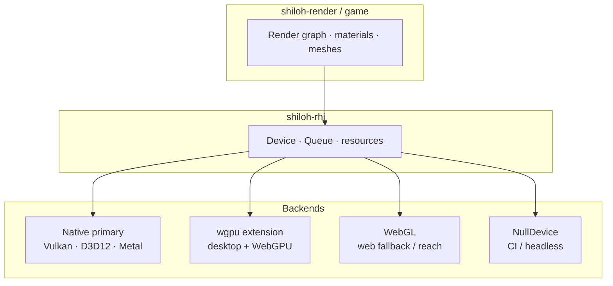

# Shiloh3D — Graphics backends

**Bootstrap (advised):** [wgpu](https://wgpu.rs) + WGSL behind `shiloh-rhi` / `shiloh-render` — never as a permanent public game dependency.  
**Long-term desktop shipping:** native Vulkan / D3D12 / Metal implementing the **same** RHI (Unreal-like control).  
**Web:** WebGL for reach, WebGPU via the wgpu backend where available.

Custom Shiloh interfaces wrap all of the above so backends can be replaced ([TECH_STACK.md](TECH_STACK.md)).

## Priority order

| Priority | Backend | Role |
|---|---|---|
| **Bootstrap** | **wgpu** + WGSL | Advised starting implementation (desktop + WebGPU) |
| **Shipping desktop** | **Native** (Vulkan, D3D12, Metal) | Production control / parity with native-first engines |
| **Web reach** | **WebGL** | Broad browsers when WebGPU is missing |
| **Utility** | **Null** | Headless tests, CI, servers without a GPU |

Today’s showcase uses the **wgpu bootstrap**. Games and tools should still only talk to **Shiloh** render/RHI types — not `wgpu` directly — so a native backend can replace it later.

## Feature map (`shiloh-rhi`)

| Cargo feature | Intent |
|---|---|
| *(default)* | `NullDevice` only — no GPU linker deps |
| `wgpu` | **Bootstrap / extension** — portable wgpu + WebGPU |
| `native` | Platform native APIs (Vulkan / D3D12 / Metal) — shipping desktop path |
| `webgl` | WebGL backend for `wasm32` / browser canvas |
| `web` | Convenience: `webgl` + `wgpu` (browser matrix) |

Exact native crate choices (e.g. `ash`, `windows` D3D12, `metal`) land when Phase 1 folds GPU init into `shiloh-app`.

## Shaders

- **Native / wgpu:** WGSL and/or SPIR-V (and platform equivalents) via the active backend  
- **WebGL:** GLSL ES subset (or transpiled from a common source)  
- Author once at the `shiloh-render` material layer; backends consume compiled variants  

## Platform matrix (target)

| Target | Primary | Extension / alt |
|---|---|---|
| Windows | D3D12 (Vulkan optional) | wgpu |
| macOS / iOS | Metal | wgpu |
| Linux | Vulkan | wgpu |
| Browser | WebGL (+ WebGPU via wgpu when present) | — |
| CI / headless | Null | — |

## Relationship to the product thesis

wgpu bootstrap gets a vertical slice shipping sooner. Native backends keep headroom for excellent PBR and large worlds. WebGL/WebGPU keep editor previews and web demos on the **same** Shiloh RHI — without baking third-party crates into the public API.
