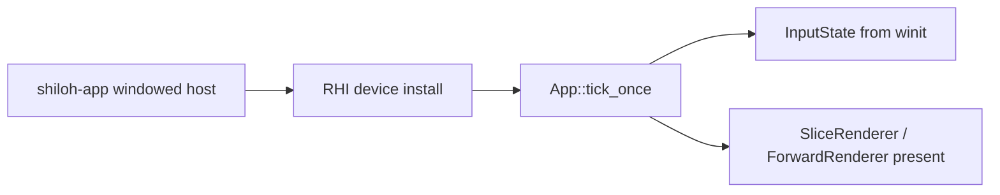

# Hello 3D — Phase 1 template

Minimal path to a lit, depth-tested frame in Shiloh3D. Use this as the onboarding
template; the full vertical slice lives in `shiloh-demo`.

## Loop



## Pieces

| Step | Crate / API |
|---|---|
| Window + event loop | `shiloh_app::run_windowed(AppBuilder::new(), RhiBackendKind::Wgpu)` |
| Input mapping | `shiloh_app::winit_map::{map_key, map_mouse}` → `App.input` |
| Timing | `shiloh_core::Time` inside `App::tick_once` |
| Hierarchy | `shiloh_scene::{set_parent, propagate_transforms}` |
| ECS | `shiloh_ecs::World` insert / `for_each` |
| Mesh + depth + albedo | `shiloh_render::SliceRenderer` (wgpu bootstrap) |
| Selectable RHI | `native` \| `wgpu` \| `null` stubs in `shiloh-rhi` |

## Run the integrated sample

```bash
# Full Phase 2 slice (hello 3D + lights + water + HUD)
cargo run -p shiloh-demo

# Headless smoke (CI)
cargo run -p shiloh-demo -- --headless-frames 60

# App host only (lifecycle + RHI install, no slice present yet)
cargo run -p shiloh-app --features desktop
```

## Depth + mesh checklist

1. Create a window (`run_windowed` or demo `EventLoop`).
2. Create a GPU device / surface (`SliceRenderer::new` or RHI `Device`).
3. Upload a mesh with positions + normals + UVs.
4. Bind a depth texture and clear depth each frame.
5. Draw with a perspective or isometric view-proj.
6. Sample an albedo texture in the fragment stage.

Phase 1 is **done** when those steps are green on desktop CI. Phase 2 adds PBR
lighting, shadows, editor authoring, and the Blackmarsh presentation track.
