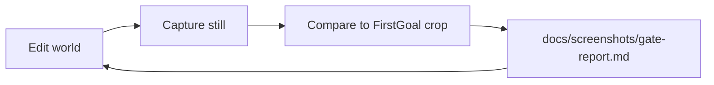

# Phase Compete — Godot-easy · Unreal-capable · FirstGoal E2E gate

**North star:** Shiloh Studio must feel **as easy as Godot** and eventually **beat Unreal** on the *selected* fronts we care about (usability, outdoor world authoring, PBR look, bundleable Christian-owned runtime).

**Christian-owned / bundleable:** your game ships Shiloh underneath, like teams ship Unreal or Godot today.

**E2E success (hard gate):** the live Forest Valley still must **match the quality of the uploaded FirstGoal Studio editor image** (viewport crop), not merely pass soft color heuristics.

| Reference | Path |
|---|---|
| Full uploaded editor mockup | [`references/firstgoal-studio-editor.png`](references/firstgoal-studio-editor.png) |
| Viewport crop (compare target) | [`references/firstgoal-valley-viewport.png`](references/firstgoal-valley-viewport.png) |

Blackmarsh swamp water/effects remain a **later** bar ([QUALITY_BAR.md](QUALITY_BAR.md)) after this outdoor still passes.

---

## Why a separate “Compete” phase?

Phases 1–4 built foundations. Phase 5 built world authoring.  
**Phase Compete** asks every night: “are we closer to FirstGoal?” with **automatic visual evidence**.



---

## E2E pass / fail (authoritative)

```bash
cargo run -p shiloh-editor --example visual_gate
```

Exit **0** only when **all** of these hold:

| Gate | Pass when |
|---|---|
| **Similarity** | Composite score ≥ **0.42** vs `firstgoal-valley-viewport.png` (SSIM + hist corr + MAE) |
| **FirstGoal features** | ≥ **70**/100 — sky band, edge detail, non-flat runs, water/cool mid, depth, warm sun |
| **Phase requirements** | ≥ **80**/100 — EDITOR_UX, terrain/foliage, Rhai, layouts, ray, docs, density |

Exit **1** otherwise. Greybox cone/box proxies **must fail**. Soft “vegetation %” alone is **not** success.

Latest report: [`docs/screenshots/gate-report.md`](screenshots/gate-report.md) · capture: [`gate-latest.png`](screenshots/gate-latest.png)

---

## Goals (product)

| Goal | Pass when |
|---|---|
| **Godot-easy** | Place, select, move, sculpt with QWER + Modes; Scene tree stays in Script |
| **Unreal-capable (selected)** | Landscape + Foliage Modes; Content drawer; Play; outdoor still photographic |
| **Beat Unreal (long)** | Godot authoring speed + selected Unreal-class look — **FirstGoal E2E PASS** |

---

## Modes required for Compete

Borrowed UX (see [EDITOR_UX.md](EDITOR_UX.md)):

- Godot: docks, QWER, layouts, tree stays in Script  
- Unreal: Shift+1 Select · Shift+2 Landscape · Shift+3 Foliage · Content drawer  
- Blender-like: **RayAccurate** (Shift+4) via Parry in `shiloh-ray`

---

## Relation to numbered phases

| Phase | Role |
|---|---|
| 1–2 | Done — core + usable slice |
| 3 | Exit done |
| 4 | Foundations only — GI/GPU-driven still open |
| **5** | World authoring shell — **landed**; judged by Compete E2E |
| **Compete** | FirstGoal similarity gate that *decides* success |

Ship nightly: improve textured valley → `visual_gate` → read FAIL/PASS → iterate until FirstGoal match.
