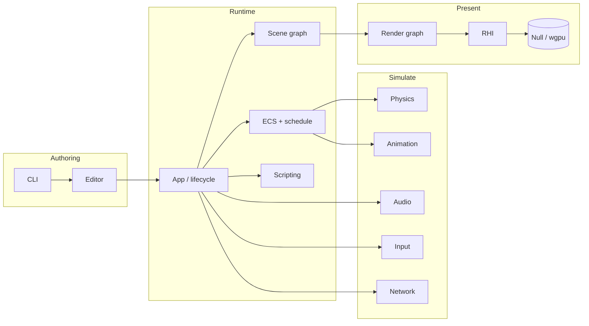
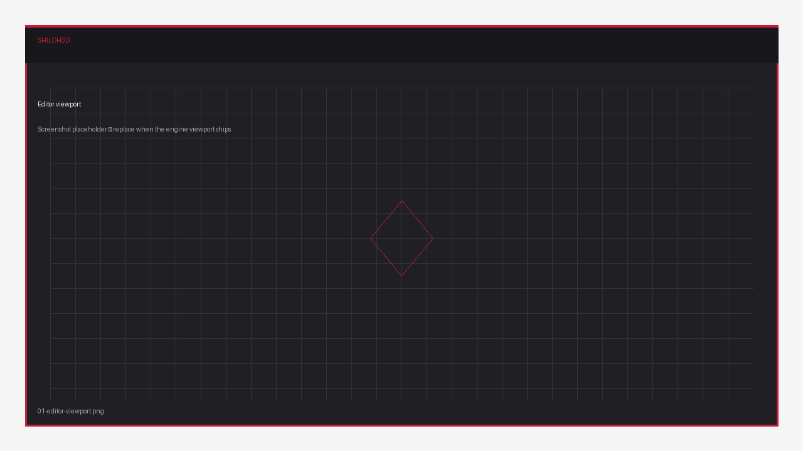
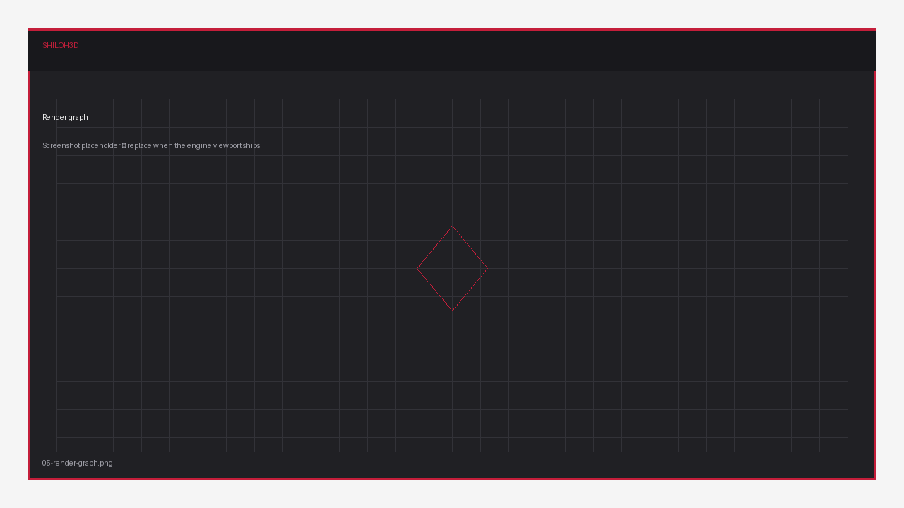
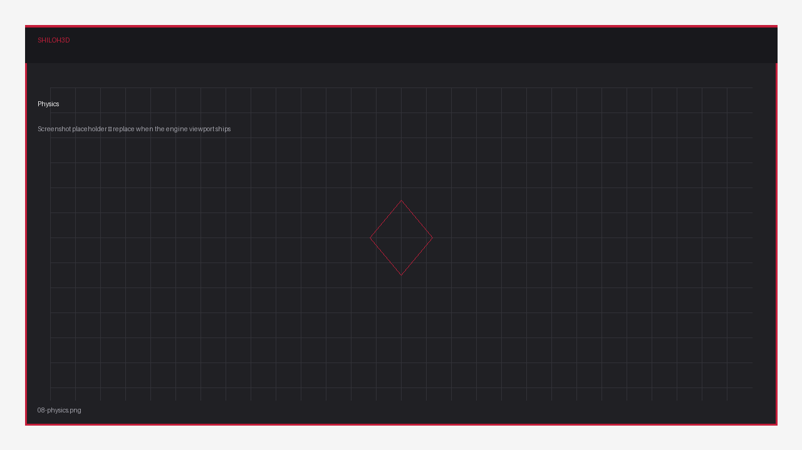

<p align="center">
  
</p>

<h1 align="center">Shiloh3D — Premium Tech Brief</h1>

<p align="center">
  <em>Engine overview · module map · visual gallery</em><br/>
  Version <strong>0.1.0</strong> · Rust edition <strong>2024</strong> · Status: <strong>foundation</strong>
</p>

---

## Brand

The Shiloh3D mark is a faceted crimson hexagon with a cut **S** — low-poly geometry for a real-time 3D engine. Wordmark: **SHILOH** in charcoal, **3D** in brand red, with a spaced **GAME ENGINE** line beneath.

| Asset | Path | Specs |
|---|---|---|
| Primary logo | [`../logo_shiloh3d.png`](../logo_shiloh3d.png) | 1254×1254 PNG, RGB |

---

## Positioning

Shiloh3D is a **from-scratch Rust 3D engine**: modular crates, cache-conscious ECS, job scheduling, and a render-graph front end over an abstract RHI. Defaults stay **pure Rust** (headless / null GPU) so CI and tooling never require Vulkan/Metal SDKs. Production graphics plug in via optional `wgpu`.

**Who it’s for**

- Engine and gameplay programmers who want a clear Rust crate graph  
- Teams that want scripting (Rust modules now; JavaScript / Rhai later) without abandoning native performance  
- Projects that need headless simulation and a future editor on the same runtime  

---

## Visual architecture



### Data & control flow (one frame)

| Stage | Crate | What happens |
|---|---|---|
| 1. Time | `shiloh-core` | Delta + fixed-timestep accumulator |
| 2. Input | `shiloh-input` | Swap previous/current button buffers |
| 3. Systems | `shiloh-ecs` | PreUpdate → Update → PostUpdate |
| 4. Fixed | `shiloh-physics` (+ schedule) | Deterministic steps for sim |
| 5. Scripts | `shiloh-scripting` | Rust modules (JS backend planned) |
| 6. Render | `shiloh-render` + `shiloh-rhi` | Build graph → encode → present |

---

## Module directory

| Module | Premium summary |
|---|---|
| **shiloh-core** | Generational handles, clocks, work-stealing jobs, TOML config, tracing |
| **shiloh-ecs** | Archetype SoA world, staged schedules, system trait object model |
| **shiloh-rhi** | Backend-agnostic buffers/textures/encoders; `NullDevice` shipped; wgpu feature-gated |
| **shiloh-render** | Transient render graph with resource IDs and topological pass order |
| **shiloh-scene** | Local/global transforms, parent/children, prefab stubs |
| **shiloh-assets** | Path-keyed cache, importers, JSON packages, optional file watch |
| **shiloh-physics** | Pluggable `PhysicsBackend`; stub gravity integrator for bring-up |
| **shiloh-animation** | Joints, clips, blend layers, simple state machine |
| **shiloh-audio** | Listener + spatial sources; f32 mixer skeleton |
| **shiloh-input** | Keys/mouse/gamepad; pressed / down / released; action maps |
| **shiloh-network** | `NetId`, channels, in-memory loopback transport |
| **shiloh-scripting** | `ScriptModule` + registry; custom language backends next |
| **shiloh-app** | Headless (default) or future windowed host |
| **shiloh-editor** | `shiloh.project.json`, selection set |
| **shiloh-cli** | `new` · `info` · `package` |

---

## Technology highlights

| Pillar | Technique |
|---|---|
| Identity | Packed index + generation handles (`u64`) |
| Memory | Archetype columns (SoA), per-frame scratch allocator |
| CPU scale | Crossbeam injector + stealers |
| GPU scale | Render graph lifetimes → fewer hazards, clearer passes |
| Safety | `forbid(unsafe_code)` on most crates; unsafe only where proven necessary |
| Ship profile | Thin LTO, `codegen-units = 1`, panic abort |

### Scripting story

| Tier | Language | Status |
|---|---|---|
| 1 | Rust `ScriptModule` | **Available** |
| 2 | JavaScript (e.g. Boa — pure Rust) | Planned |
| 3 | Rhai (embeddable Rust DSL) | Planned |
| 4 | Visual scripting | Later |

Gameplay authors will call a small safe API (spawn, transform, input, events) — not raw ECS internals.

---

## Gallery — engine in action

> **Status:** Foundation build. The gallery uses **branded placeholders** (1280×720) so the page layout is ready.  
> Replace each file in [`screenshots/`](screenshots/) with a real capture when the viewport ships — same filenames, no markdown edits required.

### Editor & viewport

| Preview | Caption |
|---|---|
|  | **Editor viewport** — scene camera, gizmo, grid *(placeholder)* |
|  | **Scene hierarchy** — entities, prefabs, multi-select *(placeholder)* |
|  | **Inspector** — components & materials *(placeholder)* |

### Rendering & play mode

| Preview | Caption |
|---|---|
|  | **Play mode** — runtime from the editor *(placeholder)* |
|  | **Render graph** — pass visualization *(placeholder)* |
|  | **Lit scene** — mesh + PBR material sample *(placeholder)* |

### Systems & tooling

| Preview | Caption |
|---|---|
|  | **Animation** — skeleton debug draw *(placeholder)* |
|  | **Physics** — colliders & contacts *(placeholder)* |
|  | **CLI & project** — `shiloh-cli new` flow *(placeholder)* |

### Placeholder policy

Current PNGs are **branded stubs**, not live engine frames. When you capture a real shot:

1. Export PNG (1920×1080 or 1280×720 recommended).  
2. Overwrite the matching name under `docs/screenshots/`.  
3. Keep file size reasonable (< ~2 MB each).  
4. Optional: add a one-line credit or build hash in the image footer.

A [`screenshots/README.md`](screenshots/README.md) lists exact filenames and suggested content.

---

## Build matrix (targets)

| Target | Notes |
|---|---|
| Linux desktop | Primary; `gcc`/`clang` linker |
| Headless CI | Default features — no GPU required |
| GPU apps | `--features wgpu` on RHI / render / app |
| Windowed host | `--features window` on `shiloh-app` (when wired) |

```bash
cargo check --workspace
cargo run -p shiloh-app
cargo run -p shiloh-cli -- info
```

---

## Related links

- [Root README](../README.md) — architecture diagrams & quick start  
- [Workspace `Cargo.toml`](../Cargo.toml) — crate members & shared deps  
- Logo — [`logo_shiloh3d.png`](../logo_shiloh3d.png)

---

<p align="center">
  <sub>© Shiloh3D Contributors · Premium brief generated for engine documentation · Update gallery when the viewport ships.</sub>
</p>
