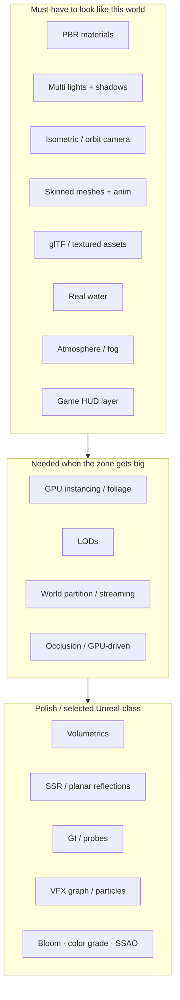

# Shiloh3D — Quality bar analysis

**Reference:** isometric dark-fantasy ARPG combat in a swamp (“Blackmarsh / The Lions Gate”).  
Asset: [`references/quality-bar-arpg-swamp.png`](references/quality-bar-arpg-swamp.png)

> **Confirmed north star (user):** this shot is the target for **effects, atmosphere, and real water** — not a soft “nice to have.” Graphics work is judged against this mood and water fidelity.

This is roughly **Diablo IV / Path of Exile–class presentation**: dense foliage, wet PBR materials, multi-light night scene, **interactive reflective water**, skinned combatants, ornate HUD. It is a **credible long-term graphics + content bar** for Shiloh3D’s “excellent PBR + large-world” thesis.

---

## Real water (explicit bar from the shot)

Today’s slice has **water v1** (flat tinted plane + animated normals + fresnel). The reference requires **water that reads as a volume characters stand in**:

| Cue in the shot | Engine requirement | Status |
|---|---|---|
| Knee-deep murky brown water | Depth-based tint / absorption; partial submersion of legs | 🔄 v1 tint only |
| Circular ripples & wakes at feet | Interaction FX (CPU/GPU ripples or decals) driven by movers | ⬜ |
| Reflections of arch, torches, trees | Planar reflection **or** SSR on water; torch bloom in reflection | ⬜ |
| Lily pads / reeds on surface | Instanced foliage with depth/alpha sort over water | ⬜ |
| Torch orange on wet stone + water | Multi point lights + specular on wet materials | 🔄 lights exist; wetness map ⬜ |

**Water roadmap (ordered):**

1. **v2 — believable swamp plane:** refraction/depth fog color, sharper normals, soft shore foam, cheap planar reflection of a low-res scene color  
2. **v3 — interaction:** foot/character ripple rings + wake trails  
3. **v4 — Blackmarsh-class:** SSR or high-quality planar, wetness on nearby materials, particle splashes  

Atmosphere tied to the same shot: **height/distance fog that thickens with depth**, warm torch pools vs cool ambient, optional cheap volumetrics later — not a flat gray clear.

---

## What the shot is doing (systems read)

| Visual cue in the shot | Engine system required |
|---|---|
| Wet plate armor, slimy creature skin, rough stone | **PBR** (albedo/metal/rough/normal; wetness or clearcoat) |
| Cool moonlight + warm torch pools | **Directional + point lights**, different colors/intensities |
| Characters grounded in mud/water | **Shadows** (cascaded or atlas) + contact grounding |
| Murky water, reflections, foot ripples | **Real water** (depth tint, normals, reflections) + **interaction FX** |
| Mist between trees | **Height fog / volumetric-ish atmosphere** |
| Dense reeds, pads, moss | **Instanced foliage** + alpha/alpha-to-coverage; LODs |
| Carved arch, gnarled trunks | **High-detail meshes** + normal maps; glTF pipeline |
| Player + swamp stalkers | **Skeletal animation**, blend/state machine, multiple skinned draws |
| Health/mana globes, hotbar, minimap, quest log | **Screen-space UI** + world→UI projection for minimap |
| Named region on map | **Large-world** data (streaming / partitions) |
| Splash at feet | **Particles / decals** tied to movement + water |

Camera: **high isometric / top-down** (not free FPS). First-class **ortho or constrained perspective** camera mode.

---

## Must / should / later

### Must-have (without these, the scene cannot read as this genre)

1. Textured **PBR** mesh pass  
2. **glTF** import: meshes, materials, skins, animations  
3. **Directional + several point lights** with **shadows**  
4. **Skinned animation** playback  
5. **Isometric/ARPG camera** + depth-correct transparent sorting  
6. Basic **HDR + tonemap + color grade**  
7. **HUD** pass over the 3D view  
8. **Real water path** (at least v2 depth + reflection + interaction plan) — user-confirmed  

### Should-have (makes Blackmarsh believable)

9. **Wetness** on materials near water  
10. **Height fog** (volumetrics optional after)  
11. **GPU instancing** for props/foliage  
12. **Particle** splashes / torch fire  
13. **Audio**: spatial ambience + footstep/water  

### Later / competitive (do not block content loop)

14. True **volumetric lighting**, high-end **GI**  
15. **World partitioning / streaming**  
16. **GPU-driven** foliage / occlusion  
17. Fancy HUD orb shaders  
18. Web parity at this fidelity (reduced lights/water)

---

## Map onto Shiloh phases

| Phase | What to deliver toward this bar |
|---|---|
| **1 — Core runtime** | ✅ Window, RHI, loop, ECS, hierarchy, textured mesh |
| **2 — Usable 3D (vertical slice)** | ✅ PBR path, lights/shadows, iso, glTF→GPU, skinned, HUD, fog v1, **water v1**, editor H/I/play, physics+audio one-shot |
| **3 — Production + Blackmarsh water/FX** | Water v2–v3, wetness, foliage tools, particles, better fog; hot reload, packing, Tracy |
| **4 — Competitive** | SSR-class water, volumetrics, GPU-driven, streaming, GI strategy |

**Next graphics focus (post Phase 2 exit):** water v2 (depth + planar reflection) and atmosphere (height fog + torch pools), then ripple interaction — so the swamp reads like the reference, not a tinted quad.

**Vertical slice already proven**

> Iso swamp-like demo tile, PBR + sun + points + shadows, water v1, fog, skinned character, HUD, glTF mesh, 60 FPS path on mid-range desktop.

Deepening water/atmosphere is the bridge from “usable 3D” to “Blackmarsh-class presentation.”

---

## Subsystem checklist (engine work)

### Rendering (`shiloh-render` / `shiloh-rhi`)

| Feature | Priority | Notes |
|---|---|---|
| Material model (metal/rough PBR) | P0 | WGSL; IBL optional after direct lights |
| Shadow maps | P0 | Start: directional cascade + point (or spotlight) atlas |
| Clustered / forward+ lights | P1 | ARPG scenes are multi-point heavy |
| Normal / ORM / emissive maps | P0 | From glTF |
| Skinning on GPU | P0 | Joint matrices UBO/SSBO |
| Transparent pass + sort | P0 | Foliage, water, VFX |
| Water pass (real) | P0 | v2 depth+planar; v3 ripples; v4 SSR-class |
| Fog / atmosphere | P0 | Height fog first; volumetrics later |
| Post stack | P1 | Tonemap, grade, bloom, SSAO (SSAO can wait) |
| Instancing | P1 | Already started in demo — extend to foliage |
| Decals / particles | P1 | Splashes, torch, water wakes |

### Content pipeline (`shiloh-assets`)

| Feature | Priority |
|---|---|
| glTF 2.0 mesh + PBR materials | P0 |
| Skin + animation clips | P0 |
| Texture compression / mip chain | P1 |
| Prefab of “enemy + anim + capsule” | P2 |

### Scene / camera (`shiloh-scene`)

| Feature | Priority |
|---|---|
| Perspective + **orthographic / iso** camera | P0 |
| Hierarchy + sockets (weapon attach) | P1 |
| Layers / render layers (world vs UI) | P1 |

### Animation (`shiloh-animation`)

| Feature | Priority |
|---|---|
| Clip sampling + blend | P0 |
| State machine (locomotion / attack) | P1 |
| GPU skin upload | P0 |

### UI (`shiloh-editor` / runtime HUD)

| Feature | Priority |
|---|---|
| Hotbar + resource orbs | P0 (slice) |
| Minimap + quest tracker | P1 |
| Editor hierarchy / inspector / play | P0 (landed) |

---

## Honest gap vs the shot (today)

| Reference | Shiloh now |
|---|---|
| Murky reflective interactive water | Flat fresnel plane (v1) |
| Thick mist between trees | Distance fog only |
| Torch pools + wet stone | Points + sun; no wetness |
| Dense foliage / lily pads | Procedural cubes/spheres + one glTF cube |
| Ornate ARPG HUD | Simple NDC bars/hotbar |

Phase 2 made the **usable engine path**. Closing this table is the **Blackmarsh presentation track** (start: water v2 + height fog).
