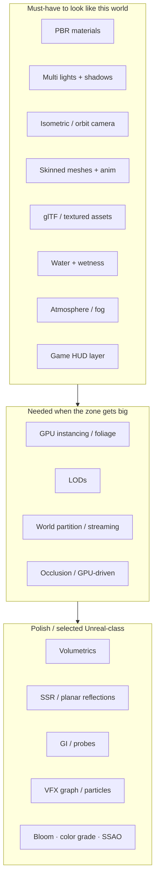

# Shiloh3D — Quality bar analysis

**Reference:** isometric dark-fantasy ARPG combat in a swamp (“Blackmarsh / The Lions Gate”).  
Asset: [`references/quality-bar-arpg-swamp.png`](references/quality-bar-arpg-swamp.png)

This is roughly **Diablo IV / Path of Exile–class presentation**: dense foliage, wet PBR materials, multi-light night scene, reflective water, skinned combatants, ornate HUD. It is a **credible long-term graphics + content bar** for Shiloh3D’s “excellent PBR + large-world” thesis — **not** a Phase 1 target.

---

## What the shot is doing (systems read)

| Visual cue in the shot | Engine system required |
|---|---|
| Wet plate armor, slimy creature skin, rough stone | **PBR** (albedo/metal/rough/normal; wetness or clearcoat) |
| Cool moonlight + warm torch pools | **Directional + point lights**, different colors/intensities |
| Characters grounded in mud/water | **Shadows** (cascaded or atlas) + contact grounding |
| Murky water, character reflections, foot ripples | **Water material** (depth tint, normals, cheap reflections) + **interaction FX** |
| Mist between trees | **Height fog / volumetric-ish atmosphere** (full raymarch later) |
| Dense reeds, pads, moss | **Instanced foliage** + alpha/alpha-to-coverage; LODs |
| Carved arch, gnarled trunks | **High-detail meshes** + normal maps; glTF pipeline |
| Player + “Swamp Stalker”-class enemies | **Skeletal animation**, blend/state machine, multiple skinned draws |
| Health/mana globes, hotbar, minimap, quest log | **Screen-space UI** (egui or custom) + world→UI projection for minimap |
| Named region on map | **Large-world** data (streaming / partitions) — not just one mesh dump |
| Splash at feet | **Particles / decals** tied to movement + water |

Camera: **high isometric / top-down** (not free FPS). Needs a first-class **ortho or constrained perspective** camera mode, not only free look.

---

## Must / should / later

### Must-have (without these, the scene cannot read as this genre)

1. Textured **PBR** mesh pass (not only vertex-color Blinn-Phong)  
2. **glTF** (or equivalent) import: meshes, materials, skins, animations  
3. **Directional + several point lights** with **shadows**  
4. **Skinned animation** playback  
5. **Isometric/ARPG camera** + depth-correct transparent sorting for foliage/UI  
6. Basic **HDR + tonemap + color grade** (the “gloom” look is grading as much as lighting)  
7. **HUD** pass composited over the 3D view  

### Should-have (makes Blackmarsh believable)

8. **Water** (plane or mesh): depth fog color, animated normals, SSR *or* planar reflection  
9. **Wetness** control (material parameter or deferred wet mask)  
10. **Exponential / height fog** (full volumetrics optional)  
11. **GPU instancing** for props/foliage  
12. **Particle** splashes / torch fire  
13. **Audio**: spatial ambience + footstep/water (supports the mood even if not visible)  

### Later / competitive (Phase 3–4 — do not block the vertical slice)

14. True **volumetric lighting**, high-end **GI**  
15. **World partitioning / streaming** for continent-scale maps  
16. **GPU-driven** foliage / occlusion culling  
17. Fancy HUD fluid shaders inside orbs (can fake with flipbooks first)  
18. Web parity at this fidelity (likely reduced: fewer lights, simpler water)

---

## Map onto Shiloh phases

| Phase | What to deliver toward this bar |
|---|---|
| **1 — Core runtime** | Window, RHI, loop, input, ECS, handles, textured mesh (even one albedo) |
| **2 — Usable 3D (vertical slice)** | PBR, lights, shadows, cameras (incl. iso), glTF, skinned anim, scene save, **basic HUD**, water v1, fog v1 — *one playable swamp encounter* |
| **3 — Production** | Prefabs, hot reload, material editor, anim state machines, packing, Tracy; foliage tools; better water/FX |
| **4 — Competitive** | GPU-driven, occlusion, streaming GI strategy, large-world partition, net replication at scale |

**Vertical slice definition for this bar**

> One streamed-or-single swamp tile, glTF player + 3–6 enemies, PBR + 1 directional + 2 torches + shadows, reflective water v1, fog, isometric camera, skill hotbar HUD, 60 FPS on a mid-range desktop (wgpu bootstrap).

That proves the product thesis without waiting for Phase 4 GI.

---

## Subsystem checklist (engine work)

### Rendering (`shiloh-render` / `shiloh-rhi`)

| Feature | Priority | Notes |
|---|---|---|
| Material model (metal/rough PBR) | P0 | WGSL; IBL optional after direct lights |
| Shadow maps | P0 | Start: directional cascade + point (or spotlight) atlas |
| Clustered / forward+ lights | P1 | ARPG scenes are multi-point heavy |
| Normal / ORM / emissive maps | P0 | From glTF |
| Skinning on GPU | P0 | Joint matrices UBO/SSBO |
| Transparent pass + sort | P0 | Foliage, water, VFX |
| Water pass | P1 | Separate shader; ripple from CPU/GPU |
| Fog / atmosphere | P1 | Height fog first |
| Post stack | P1 | Tonemap, grade, bloom, SSAO (SSAO can wait) |
| Instancing | P1 | Already started in demo — extend to foliage |
| Decals / particles | P2 | Splashes, torch |

### Content pipeline (`shiloh-assets`)

| Feature | Priority |
|---|---|
| glTF 2.0 mesh + PBR materials | P0 |
| Skin + animation clips | P0 |
| Texture compression / mip chain | P1 |
| Prefab of “enemy + anim + capsule” | P2 |

### Scene / camera (`shiloh-scene`)

| Feature | Priority |
|---|---|
| Perspective + **orthographic / iso** camera | P0 |
| Hierarchy + sockets (weapon attach) | P1 |
| Layers / render layers (world vs UI) | P1 |

### Animation (`shiloh-animation`)

| Feature | Priority |
|---|---|
| Clip sampling + blend | P0 |
| State machine (locomotion / attack) | P1 |
| GPU skin upload | P0 |

### UI (`shiloh-editor` / runtime HUD)

| Feature | Priority |
|---|---|
| egui or custom immediate HUD | P0 for slice |
| Minimap (render-to-texture or 2D) | P1 |
| Ornate frames = textures, not SDF art yet | P2 |

### World scale (`shiloh-scene` / future streaming)

| Feature | Priority |
|---|---|
| Tile / cell IDs, load bounds | P2 (design now, implement when one tile works) |
| Streaming + HLOD | P3 / Phase 4 |

### Multiplayer (`shiloh-network`)

Not visible in a still, but ARPG combat implies **replication of transforms, anim state, HP** — keep net types first-class; don’t block the single-player visual slice on full netcode.

---

## Performance budget (desktop target for this density)

Rough guide for a mid GPU (e.g. GTX 1650–class and up):

| Budget | Guidance |
|---|---|
| Main view | 1920×1080, 60 FPS |
| Opaque draws | Instanced props; &lt; few hundred unique skinned characters on screen |
| Lights with shadows | 1 directional + ≤4 local shadows first |
| Transparent | Heavy — budget foliage cards carefully |
| Post | Keep stack short until CPU/GPU timers say otherwise |

Use **Tracy + GPU timestamps** before adding volumetrics or GI.

---

## What we have vs the bar (0.1.0)

| Capability | Now | Gap to reference |
|---|---|---|
| Lit mesh | Vertex-color Blinn-Phong instancing | Full PBR textures |
| Camera | Free orbit | Iso/ARPG camera mode |
| Assets | Procedural cube/sphere | glTF characters/env |
| Lights / shadows | 1 fake directional in UBO | Real multi-light + shadows |
| Water / fog / post | None | Required for swamp read |
| Skinning / anim GPU | Types only | Full path |
| HUD | None | Full ARPG chrome |
| World streaming | None | After slice |

---

## Recommendation

Treat this image as the **Phase 2–3 quality north star for “selected graphical capabilities”**, not as a checklist for Phase 1.

1. Finish Phase 1 (textures, ECS, hierarchy, app-owned window).  
2. Build the **Blackmarsh vertical slice** (table above) on **wgpu + WGSL** behind Shiloh façades.  
3. Only then invest in volumetrics, GI, and world partitioning.  

That matches the product thesis: *usable editor + excellent PBR + large-world foundations + multiplayer* — proven on one swamp fight before expanding.
