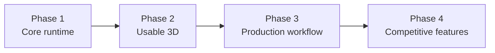

# Shiloh3D — Development Roadmap

Realistic build order for a from-scratch Rust 3D engine.  
Status reflects the tree as of **0.1.0** (foundation + showcase demo).

Legend: **Done** · **Partial** · **Not started**

---

## Vision (product north star)

Build Shiloh3D in **Rust**, and initially compete on **usability** (approachable editor and workflow) plus **selected high-end graphics** — not on matching any one commercial engine’s total feature count.

**Strongest achievable first product**

> A fast, safe, open Rust 3D engine with a polished visual editor, excellent PBR rendering, large-world support, and first-class multiplayer.

That is a credible engine direction. Trying to ship editor + renderer + physics + scripting + multiplayer + cinematics + mobile + consoles + maximal graphics *at once* will stall the project.

### Operating principles

1. **Vertical slice first** — one playable path that proves window → assets → PBR frame → input → (later) net, before broadening.  
2. **Architecture must earn expansion** — add terrain, GI, consoles, marketplace only after the slice is boringly reliable.  
3. **Usability bar** — editor and docs should feel approachable; power users still get Rust-native modules and clear crates.  
4. **Graphics bar** — aim for excellent PBR and a few Unreal-class *capabilities* (see [QUALITY_BAR.md](QUALITY_BAR.md) ARPG swamp reference), not feature parity.  
5. **Multiplayer is first-class, not bolted on** — replication types and transport live in-tree early; full netcode lands when the slice can host a session.  

### What “first product” includes (and excludes)

| In scope for the first credible product | Explicitly later |
|---|---|
| Polished visual editor (hierarchy, inspector, viewport, play mode) | Cinematic / sequencer toolchains |
| Excellent PBR + core lights + shadows | Every GI/solution and film feature |
| Large-world foundations (partitioning / streaming hooks) | Full open-world stack on day one |
| First-class multiplayer (replication + transport) | Console SKUs, mobile stores |
| Safe, fast Rust runtime + open licensing | Plugin marketplace |

Phases below still apply: **Phase 1** finishes the core loop; **Phase 2** makes the vertical slice *usable*; **Phase 3** makes it *producible*; **Phase 4** adds competitive scale features once the product thesis is proven.

---

## Phase 1 — Core runtime

Goal: a stable frame loop you can ship a tech demo on.

| Item | Status | Notes |
|---|---|---|
| Window creation | **Done** | `shiloh-app` feature `window` / `desktop`; demo still has its own showcase loop |
| GPU initialization | **Partial** | RHI selectable stub: wgpu / native / null; demo presents via wgpu `SliceRenderer` |
| Render loop | **Done** | Demo event/redraw + `App::tick_once` / headless `App::run` |
| Input | **Partial** | Double-buffered `shiloh-input` + winit mapping in demo |
| Timing | **Done** | `shiloh-core` frame + fixed timestep |
| Transform hierarchy | **Done** | `set_parent` + `propagate_transforms` → `GlobalTransform` |
| ECS | **Done** | Archetype mover with Clone columns; `for_each` / `entities_with` queries |
| Asset handles | **Partial** | Generational handles + path cache; glTF importer available |
| Basic mesh and texture rendering | **Done** | Textured PBR path in `SliceRenderer` (procedural albedo) |

**Phase 1 exit criteria**

- [x] `shiloh-app` owns window + GPU lifecycle (native preferred; wgpu extension OK for bring-up)
- [x] Selectable RHI backend: `native` | `wgpu` | `webgl` | `null` (see [GRAPHICS.md](GRAPHICS.md))
- [x] Textured mesh draw (sample albedo)
- [x] Working parent→child transform update system
- [x] ECS insert/remove preserves SoA columns; basic queries iterate
- [x] One integrated sample (current `shiloh-demo`) remains green on Win / macOS / Linux CI

**Suggested next tickets (Phase 1)**

1. ~~Finish ECS archetype mover + `Query` iteration~~  
2. ~~Texture upload + sampler bind in lit pass~~  
3. ~~Hierarchy dirty propagation (`GlobalTransform`)~~  
4. ~~Move windowed host from demo into `shiloh-app`~~ (host present; demo still owns slice present)  
5. Depth + mesh path documented as the “hello 3D” template  

---

## Phase 2 — Usable 3D engine

Goal: a **vertical slice** — author a scene in the editor, see excellent-enough PBR in play mode, save it, run it. Prove usability + selected graphics before expanding scope.

| Item | Status | Notes |
|---|---|---|
| PBR materials | **Partial** | Textured forward PBR-ish in `SliceRenderer`; metallic/rough maps later |
| Directional, point and spot lighting | **Partial** | Directional + 2 points in slice; spots TBD |
| Shadows | **Partial** | Directional shadow map in slice |
| Cameras | **Done** | Perspective / ortho / isometric helpers |
| glTF import | **Partial** | `load_gltf` + optional demo load; GPU upload of imported meshes TBD |
| Physics | **Partial** | Backend trait + stub; Rapier (Rust) planned |
| Audio | **Partial** | Mixer stub; no device output yet |
| Scene serialization | **Partial** | Shared scene JSON (`save_scene` / `load_scene`); editor UI TBD |
| Basic editor | **Partial** | Project files + selection model; no viewport UI |

**Phase 2 exit criteria**

- [ ] Load a glTF mesh onto the GPU and render with PBR + directional light + shadows *(importer + slice lighting/shadows done; procedural skinned mesh in demo until `sample.glb` GPU path)*  
- [x] Save/load a scene JSON the editor and runtime share  
- [ ] Physics bodies move entities; audio plays a one-shot  
- [ ] Editor: hierarchy, inspector, play mode  

---

## Phase 3 — Production workflow

Goal: day-to-day content pipeline for a small team.

| Item | Status | Notes |
|---|---|---|
| Prefabs | **Partial** | Name-only stub |
| Hot reload | **Partial** | Feature-gated `notify` watcher; not wired to GPU assets |
| Material editor | **Not started** | |
| Animation state machine | **Partial** | Types in `shiloh-animation`; no skinned GPU path |
| Terrain | **Not started** | |
| Navigation | **Not started** | |
| Packaging | **Partial** | `shiloh-cli` package manifest helper |
| Crash reporting | **Not started** | |
| Profiling tools | **Not started** | See also `docs/PERF_REVIEW.md` |

**Phase 3 exit criteria**

- [ ] Edit material → hot reload in play mode  
- [ ] Skinned animation from glTF with state machine  
- [ ] Ship a packaged build (CLI) with crash + frame profiler hooks  

---

## Phase 4 — Competitive features

Goal: scale and differentiate — **only after** Phases 1–3 are boringly reliable and the north-star slice (editor · PBR · large-world hooks · multiplayer) has shipped to real users.

| Item | Status | Notes |
|---|---|---|
| GPU-driven rendering | **Not started** | Instancing today is CPU-written |
| Occlusion culling | **Not started** | |
| Virtualized or streamed geometry | **Not started** | |
| Global illumination strategy | **Not started** | Pick one: probes / DDGI / path-traced offline, etc. |
| World partitioning | **Not started** | |
| Multiplayer replication | **Partial** | IDs + in-memory transport only |
| Visual scripting | **Not started** | Rust `ScriptModule` first; JS/Rhai then visual |
| Plugin marketplace | **Not started** | |
| Console work | **Not started** | After desktop is solid |

**Phase 4 rule:** do not start these until Phase 2 exit criteria are met and Phase 3 packaging + profiling exist.

---

## Sequence diagram

---

## Current focus

**Finish Phase 1, then a Phase 2 vertical slice** aimed at the north star (editor · PBR · world foundations · multiplayer) — not a kitchen-sink engine.

The showcase proves window + GPU + loop + input + timing + mesh lighting + crate wiring. Gaps that block calling Phase 1 “done”: textures, hierarchy systems, complete ECS, and folding the windowed host into `shiloh-app`.

Related docs:

- [Tech stack](TECH_STACK.md) — advised crates + façade rules  
- [Graphics backends](GRAPHICS.md) — wgpu bootstrap · native shipping · WebGL  
- [Quality bar](QUALITY_BAR.md) — ARPG swamp reference → required systems  
- [Performance review](PERF_REVIEW.md) — hot-path findings while closing Phase 1  
- [Premium tech brief](PREMIUM.md) — architecture & gallery  
- [Showcase demo](../shiloh-demo/README.md) — run instructions (wgpu bootstrap)  
