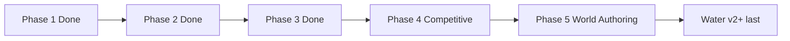

# Shiloh3D — Development Roadmap

Realistic build order for a from-scratch Rust 3D engine.  
Status reflects the tree as of **0.1.0**.

Legend: **Done** · **Partial** · **Not started**

---

## Vision (product north star)

Build Shiloh3D in **Rust**, and initially compete on **usability** (approachable editor and workflow) plus **selected high-end graphics** — not on matching any one commercial engine’s total feature count.

Shiloh3D is **Christian-owned** and designed to be **bundled into other games** (the same role Unreal / Godot play for many titles): a shippable runtime + editor stack your product owns, not a closed storefront.

**Strongest achievable first product**

> A fast, safe, open Rust 3D engine with a polished visual editor, excellent PBR rendering, large-world support, and first-class multiplayer.

### Operating principles

1. **Vertical slice first** — one playable path that proves window → assets → PBR frame → input → (later) net, before broadening.  
2. **Architecture must earn expansion** — add terrain, GI, consoles, marketplace only after the slice is boringly reliable.  
3. **Usability bar** — editor and docs should feel approachable; power users still get Rust-native modules and clear crates.  
4. **Graphics bar** — aim for excellent PBR and a few Unreal-class *capabilities* (see [QUALITY_BAR.md](QUALITY_BAR.md)), not feature parity.  
5. **Multiplayer is first-class, not bolted on** — replication types and transport live in-tree early.  

Phases: **Phase 1** core · **Phase 2** slice · **Phase 3** production exit · **Phase 4** competitive foundations · **Phase 5** world authoring · **Phase Compete** Godot-easy / Unreal-capable visual gate ([PHASE_COMPETE.md](PHASE_COMPETE.md)). **Water v2+** last.

---

## Phase 1 — Core runtime — **DONE**

Goal: a stable frame loop you can ship a tech demo on.

| Item | Status | Notes |
|---|---|---|
| Window creation | **Done** | `shiloh-app` `run_windowed` + demo event loop |
| GPU initialization | **Done** | Selectable RHI stubs; demo presents via `SliceRenderer` |
| Render loop | **Done** | `App::tick_once` / headless `App::run` |
| Input | **Done** | `shiloh-input` + winit map in `shiloh-app` host and demo |
| Timing | **Done** | `shiloh-core` frame + fixed timestep |
| Transform hierarchy | **Done** | `set_parent` + `propagate_transforms` |
| ECS | **Done** | Archetype mover; queries |
| Asset handles | **Done** | Generational handles + path cache + glTF |
| Basic mesh and texture rendering | **Done** | Textured PBR path in `SliceRenderer` |
| Hello 3D template | **Done** | [HELLO_3D.md](HELLO_3D.md) |

**Phase 1 exit criteria** — all met.

---

## Phase 2 — Usable 3D engine — **DONE**

Goal: author a scene in the editor, see excellent-enough PBR in play mode, save it, run it.

| Item | Status | Notes |
|---|---|---|
| PBR materials | **Done** | Forward PBR + `MaterialAsset` JSON |
| Directional, point and spot lighting | **Done** | Sun + 2 points + spot cone in slice |
| Shadows | **Done** | Directional 2048 shadow map |
| Cameras | **Done** | Perspective / ortho / isometric |
| glTF import | **Done** | `load_gltf` → GPU |
| Physics | **Partial** | Stub integrator; Rapier later |
| Audio | **Partial** | Software mixer one-shot; device backend later |
| Scene serialization | **Done** | Shared scene JSON + parents |
| Basic editor | **Done** | Premium Studio shell + **live wgpu viewport** (offscreen SliceRenderer → egui), node graph, world items, URL import |

**Phase 2 exit criteria** — all met. Live 3D viewport is embedded via offscreen `SliceRenderer` readback (shared-device egui-wgpu alignment is a later polish).

---

## Phase 3 — Production workflow — **DONE (exit)**

Goal: day-to-day content pipeline for a small team.

| Item | Status | Notes |
|---|---|---|
| Prefabs | **Done** | Serialize/spawn `Prefab` with entity records |
| Hot reload | **Done** | `HotReloader` → `MaterialAsset` albedo in demo |
| Material editor | **Partial** | JSON authoring; dedicated material UI later |
| Animation state machine | **Done** | Clip sample + blend SM → `SkinPalette::from_pose` |
| glTF animation clips | **Done** | Import → `AnimationClip`; demo falls back to procedural sway |
| Terrain | **Not started** | Deferred (not exit-blocking) |
| Navigation | **Not started** | Deferred (not exit-blocking) |
| Packaging | **Done** | `shiloh-cli cook` → `dist/package` |
| Crash reporting | **Done** | Panic hook → `crashes/` |
| Profiling tools | **Done** | CPU `ProfileScope` in `App::tick_once` |

**Phase 3 exit criteria**

- [x] Edit material → hot reload path in play/demo  
- [x] Skinned animation from clips with state machine → `SkinPalette`  
- [x] Ship a packaged build (CLI cook) with crash + frame profiler hooks  

---

## Phase 4 — Competitive features — **IN PROGRESS**

| Item | Status | Notes |
|---|---|---|
| GPU-driven rendering | **Not started** | |
| Occlusion culling | **Not started** | |
| Virtualized or streamed geometry | **Not started** | |
| Global illumination strategy | **Not started** | |
| World partitioning | **Partial** | `WorldPartition` focus + `tick_streaming` load/evict |
| Multiplayer replication | **Partial** | `ReplicationBuffer::flush_to` over `Transport` |
| Visual scripting | **Partial** | IR + `VisualGraph::execute` Event→Action walk |
| Plugin marketplace | **Not started** | |
| Console work | **Not started** | |

---

## Phase 5 — World Editor & Authoring Scripting — **EXIT DONE** (iterate via Phase Compete)

Goal: Godot-familiar Studio shell + Unreal Landscape/Foliage Modes + Rhai/visual scripting, so Forest_Valley reads as a real outdoor still. UX contract: [EDITOR_UX.md](EDITOR_UX.md).

| Item | Status | Notes |
|---|---|---|
| Godot dock shell + layouts | **Done** | Layouts JSON; distraction-free; workspace 3D/Script/Game |
| Unreal Modes Shift+1..3 | **Done** | Select / Landscape / Foliage + RayAccurate |
| QWER + axis gizmo + snap | **Done** | Axis handles; grid snap; Ctrl free |
| Landscape sculpt + 4-layer paint | **Done** | Grass/dirt/rock/sand — no DIY graph |
| Foliage paint mode | **Done** | Density / erase → live instances |
| Content Browser drawer | **Done** | Ctrl+Space overlay |
| Blender glTF peer pipeline | **Done** | Cook docs + `*.shiloh.json` collision/LOD stubs |
| Rhai scripting host | **Done** | `ScriptComponent` + Play |
| Visual graph actions | **Done** | Spawn / translate / signal / audio |
| Valley photoreal still gate | **FAIL (Compete)** | E2E vs FirstGoal crop — greybox must not pass |

**Phase 5 exit criteria**

- [x] Godot user recognizes docks/QWER; Unreal user recognizes Modes + Landscape/Foliage  
- [x] Outdoor tile without opening a material graph  
- [x] Play runs Rhai or visual graph on ≥1 entity  
- [ ] **E2E:** `visual_gate` PASS vs uploaded FirstGoal Studio viewport ([PHASE_COMPETE.md](PHASE_COMPETE.md))  

---

## Sequence diagram

---

## Current focus

1. **Phase Compete** visual gate nightly — [PHASE_COMPETE.md](PHASE_COMPETE.md) (`visual_gate` example).  
2. **Phase 5** world editor: Modes, landscape/foliage, Rhai, valley still — [EDITOR_UX.md](EDITOR_UX.md).  
3. Grow Phase 4 foundations where they don’t block authoring.  
4. **Water v2 last** — after Compete outdoor still ≥ threshold; see [QUALITY_BAR.md](QUALITY_BAR.md).

Related docs: [PHASE_COMPETE.md](PHASE_COMPETE.md) · [EDITOR_UX.md](EDITOR_UX.md) · [HELLO_3D.md](HELLO_3D.md) · [TECH_STACK.md](TECH_STACK.md) · [GRAPHICS.md](GRAPHICS.md) · [QUALITY_BAR.md](QUALITY_BAR.md) · [SLICE_PROGRESS.md](SLICE_PROGRESS.md)
