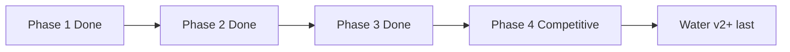

# Shiloh3D — Development Roadmap

Realistic build order for a from-scratch Rust 3D engine.  
Status reflects the tree as of **0.1.0**.

Legend: **Done** · **Partial** · **Not started**

---

## Vision (product north star)

Build Shiloh3D in **Rust**, and initially compete on **usability** (approachable editor and workflow) plus **selected high-end graphics** — not on matching any one commercial engine’s total feature count.

**Strongest achievable first product**

> A fast, safe, open Rust 3D engine with a polished visual editor, excellent PBR rendering, large-world support, and first-class multiplayer.

### Operating principles

1. **Vertical slice first** — one playable path that proves window → assets → PBR frame → input → (later) net, before broadening.  
2. **Architecture must earn expansion** — add terrain, GI, consoles, marketplace only after the slice is boringly reliable.  
3. **Usability bar** — editor and docs should feel approachable; power users still get Rust-native modules and clear crates.  
4. **Graphics bar** — aim for excellent PBR and a few Unreal-class *capabilities* (see [QUALITY_BAR.md](QUALITY_BAR.md)), not feature parity.  
5. **Multiplayer is first-class, not bolted on** — replication types and transport live in-tree early.  

Phases: **Phase 1** core loop · **Phase 2** usable vertical slice · **Phase 3** production workflow · **Phase 4** competitive scale. **Water v2+** is scheduled **last**.

---

## Phase 1 — Core runtime — **DONE**

Goal: a stable frame loop you can ship a tech demo on.

| Item | Status | Notes |
|---|---|---|
| Window creation | **Done** | `shiloh-app` `run_windowed` + demo event loop |
| GPU initialization | **Done** | Selectable RHI stubs; demo presents via `SliceRenderer` |
| Render loop | **Done** | `App::tick_once` / headless `App::run` |
| Input | **Done** | `shiloh-input` + winit map in `shiloh-app` host and demo |
| Timing | **Done** | `shiloh-core` frame + fixed timestep |
| Transform hierarchy | **Done** | `set_parent` + `propagate_transforms` |
| ECS | **Done** | Archetype mover; queries |
| Asset handles | **Done** | Generational handles + path cache + glTF |
| Basic mesh and texture rendering | **Done** | Textured PBR path in `SliceRenderer` |
| Hello 3D template | **Done** | [HELLO_3D.md](HELLO_3D.md) |

**Phase 1 exit criteria** — all met.

---

## Phase 2 — Usable 3D engine — **DONE**

Goal: author a scene in the editor, see excellent-enough PBR in play mode, save it, run it.

| Item | Status | Notes |
|---|---|---|
| PBR materials | **Done** | Forward PBR + `MaterialAsset` JSON |
| Directional, point and spot lighting | **Done** | Sun + 2 points + spot cone in slice |
| Shadows | **Done** | Directional 2048 shadow map |
| Cameras | **Done** | Perspective / ortho / isometric |
| glTF import | **Done** | `load_gltf` → GPU |
| Physics | **Partial** | Stub integrator; Rapier later |
| Audio | **Partial** | Software mixer one-shot; device backend later |
| Scene serialization | **Done** | Shared scene JSON + parents |
| Basic editor | **Done** | Premium Studio shell, node graph, world items, URL import |

**Phase 2 exit criteria** — all met. Embedded wgpu viewport remains a polish gap (not an exit blocker).

---

## Phase 3 — Production workflow — **DONE (exit)**

Goal: day-to-day content pipeline for a small team.

| Item | Status | Notes |
|---|---|---|
| Prefabs | **Done** | Serialize/spawn `Prefab` with entity records |
| Hot reload | **Done** | `HotReloader` → `MaterialAsset` albedo in demo |
| Material editor | **Partial** | JSON authoring; dedicated material UI later |
| Animation state machine | **Done** | Clip sample + blend SM → `SkinPalette::from_pose` |
| glTF animation clips | **Done** | Import → `AnimationClip`; demo falls back to procedural sway |
| Terrain | **Not started** | Deferred (not exit-blocking) |
| Navigation | **Not started** | Deferred (not exit-blocking) |
| Packaging | **Done** | `shiloh-cli cook` → `dist/package` |
| Crash reporting | **Done** | Panic hook → `crashes/` |
| Profiling tools | **Done** | CPU `ProfileScope` in `App::tick_once` |

**Phase 3 exit criteria**

- [x] Edit material → hot reload path in play/demo  
- [x] Skinned animation from clips with state machine → `SkinPalette`  
- [x] Ship a packaged build (CLI cook) with crash + frame profiler hooks  

---

## Phase 4 — Competitive features — **IN PROGRESS**

| Item | Status | Notes |
|---|---|---|
| GPU-driven rendering | **Not started** | |
| Occlusion culling | **Not started** | |
| Virtualized or streamed geometry | **Not started** | |
| Global illumination strategy | **Not started** | |
| World partitioning | **Partial** | `WorldPartition` focus + `tick_streaming` load/evict |
| Multiplayer replication | **Partial** | `ReplicationBuffer::flush_to` over `Transport` |
| Visual scripting | **Partial** | IR + `VisualGraph::execute` Event→Action walk |
| Plugin marketplace | **Not started** | |
| Console work | **Not started** | |

---

## Sequence diagram

---

## Current focus

1. Grow Phase 4: chunk asset I/O on partition, gameplay actions in visual VM, real net transport.  
2. Optional Phase 3 polish: terrain/nav, material editor UI, GPU texture rebind on hot reload.  
3. **Water v2 last** (depth + planar reflection) — after Phase 4 foundations; see [QUALITY_BAR.md](QUALITY_BAR.md).

Related docs: [HELLO_3D.md](HELLO_3D.md) · [TECH_STACK.md](TECH_STACK.md) · [GRAPHICS.md](GRAPHICS.md) · [QUALITY_BAR.md](QUALITY_BAR.md) · [SLICE_PROGRESS.md](SLICE_PROGRESS.md)
