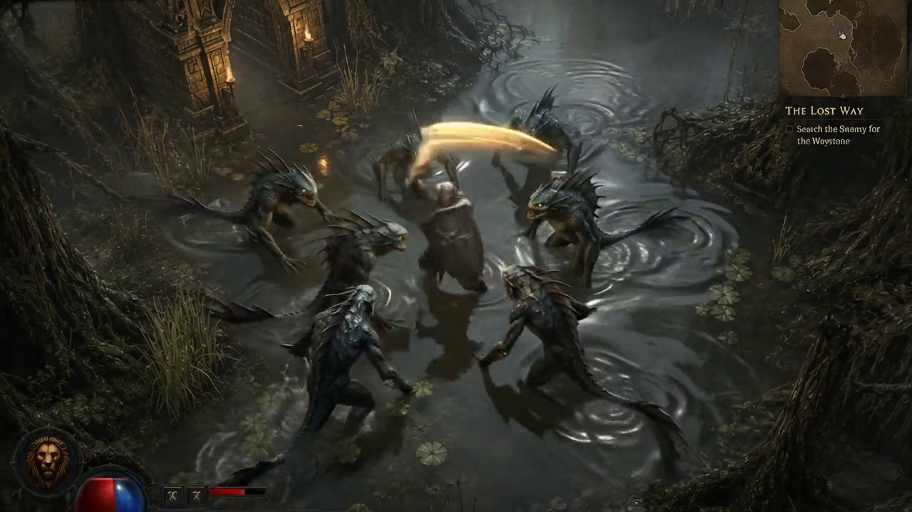

# The Lions Gate

Christian Diablo-style ARPG vertical slice on **Shiloh3D**.

<p align="center">
  <br/>
  <sub>Combat presentation target (pre-alpha gameplay is top-down slice today)</sub>
</p>

## Run

```bash
cargo run -p lions-gate --release
```

## First level (one world map)

| Zone | Role |
|---|---|
| **Lion's Haven (Town)** | Safe hub · NPCs · Bible lectern · gate north |
| **Valley Forest** | First combat · loot · gates to Town + Swamp |
| **Blackmarsh Edge** | Harder foes · better drops |

Travel: walk to gold gate markers → **F**.

## Loop

Explore → **LMB/E** strike → **F** loot → **I** inventory → return to town / push swamp.

## HUD (no mana)

- Health + XP bars  
- Prayer cooldown (**Space**) — not a mana pool  
- Inventory · Map · Bible (**B**)  

## Menu

Matches [`docs/references/lions-gate-main-menu.png`](../docs/references/lions-gate-main-menu.png): Continue · New Campaign · Church Service · Multiplayer · Bible · Options · Credits · Exit.

Character types: **Knight** · **Pathfinder** · **Shepherd**.

## Quality references

| Asset | Role |
|---|---|
| [`lions-gate-fight-01.png`](../docs/references/lions-gate-fight-01.png) | Skinned combat / knight fight target |
| [`lions-gate-fight-02.png`](../docs/references/lions-gate-fight-02.png) | Fight still (alt frame) |
| [`lions-gate-fight-03.png`](../docs/references/lions-gate-fight-03.png) | Fight still (alt frame) |
| [`lions-gate-main-menu.png`](../docs/references/lions-gate-main-menu.png) | Main menu chrome |
| [`quality-bar-arpg-swamp.png`](../docs/references/quality-bar-arpg-swamp.png) | Blackmarsh water / atmosphere bar |
